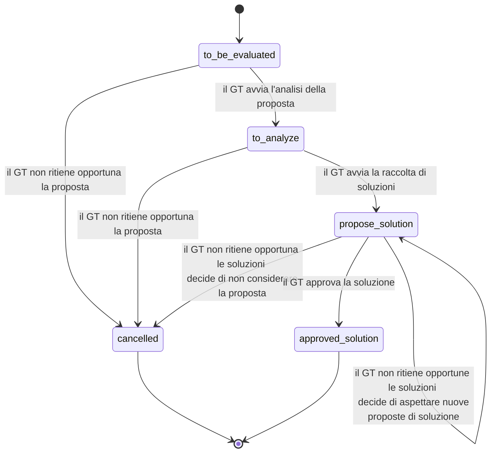

# Specifiche tecniche delle modalità telematiche di comunicazione e trasferimento dati tra il SUAP, gli uffici comunali e gli enti terzi coinvolti nel procedimento
## di cui all’articolo 5 dell’Allegato al Decreto del Presidente della Repubblica 7 settembre 2010, n. 160 e s.m.i.

Il presente repository contiene gli artefatti tecnici (BPMN, immagini, json-schema, openApi e sequence diagram) delle specifiche tecniche di cui all’articolo 5 dell’Allegato al Decreto del Presidente della Repubblica 7 settembre 2010, n. 160 e s.m.i.

Il presente branch di lavoro contiene le variazioni alla suddette specifiche tecniche in lavorazione da parte dal Gruppo Tecnico, di cui all'indicato articolo 5, a partire dal 18 gennaio 2024.

### Proposte di aggiornamento

I membri del Gruppo Tecnico, o soggetto da loro indicato, POSSONO inserire una issue per formulare una proposta di aggiornamento delle specifiche tecniche.

Al momento dell'inserimento di una issue, alle stesse DEVE essere aggiunta la label *to_be_evaluated* e DOVREBBERO essere classificate utilizzando le label:

- *fixing object schema*: modifica di un object schema quale renaming o aggiunta/rimozione di attributi;
- *fixing key object*: cambiamento/aggiunta elementi di finding delle entità scambiate tra le componenti, ad esempio metadati gestiti dal Catalogo SSU;
- *fixing mandatory object*: cambiamento di obbligatorietà di uno o più campi e/o object schema;
- *add OpenAPI path*: aggiunta di un nuovo path, operazione resa disponibili da un Erogatore ad una categoria di Fruitori, alle OpenAPI;
- *fixing text writing*: cambiamenti testuali, versione delle specifiche navigabili, di elementi che non appartengono agli artefatti tecnici quali, ad esempio, le OpenAPI).

Il processo di valutazione, analisi e risoluzione utilizzato dal Gruppo Tecnico è riportato nel seguente state diagram.

### Presentazione soluzione
I membri del Gruppo Tecnico, o soggetto da loro indicato, POSSONO presentare una soluzione relativa ad una issue nello stato *propose_solution*.

Per presentare una soluzione utilizzano lo strumento di *pull request*, DEVE:

- utilizzare il *branch* allo stesso assegnato nel rispetto della seguente naming convention [Ente di riferimento]-[Iniziale Nome][Cognome];
- effettuare una *pull request* dal *branch* al *branch* **mantaince001**.
