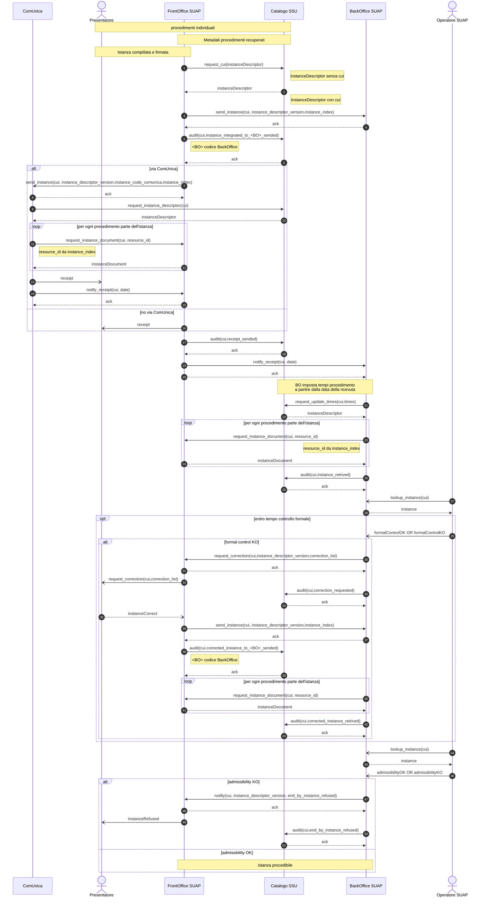

# 6.2.1. Sequence diagram generale
Il sequence diagram generale descrive il protocollo di comunicazione realizzato dalle componenti *Front-office SUAP*, *Back-office SUAP* e dal *Catalogo SSU*, per:
-   permettere al *Soggetto presentatore* di presentare un’istanza relativa al procedimento amministrativo *SUAP* di proprio interesse (sequence diagram indicato con “Presentatore”) ;
-   dare seguito al controllo formale e all’ammissibilità da parte del *SUAP* ( sequence diagram indicato con “Operatore SUAP”).

Nel sequence diagram generale è presente anche il sistema *ComUnica* per contemplare l'ipotesi di presentazione della SCIA *SUAP* contestualmente alla comunicazione unica.

Nel sequence diagram generale si assume che il *Front-office SUAP*, attraverso le interazioni con il *Soggetto presentatore*, individui l’insieme di procedimenti da avviare. Per dare seguito a tale necessità: 
●	il *Front-office SUAP* DEVE utilizzare gli e-service indicati al paragrafo “8.5.1. e-service per la consultazione dei metadati” esposti dal *Catalogo SSU* per recuperare i procedimenti amministrativi/fattispecie e il regime amministrativo, *moduli digitali* e allegati ad esso relazionati, registrati nello stesso catalogo (vedi “6.3. Metadati per istanziazione dei protocolli di comunicazione”); 
●	i *metadati* recuperati dal *Catalogo SSU* DEVONO essere utilizzati dal *Front-office SUAP* per definire il descrittore del procedimento amministrativo unico (vedi “6.4. Descrittore dell’istanza di un procedimento SUAP”) registrato dal *Catalogo SSU* e condiviso con le altre componenti coinvolte nel *Processo SUAP*.

Figura 6. Sequence diagram generale (General-001)

> vai a [6.2. Protocolli di comunicazione](06_02.md)
