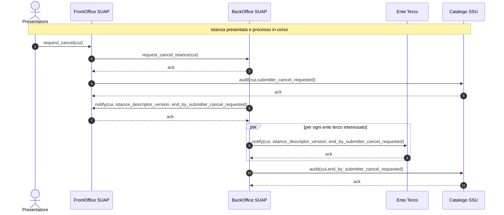

# 6.2.4. Sequence diagram cancellazione istanza

Il sequence diagram cancellazione istanza descrive il protocollo di comunicazione realizzato dal *Front-office SUAP*, *Back-office SUAP*, *Enti terzi* e dal *Catalogo SSU*, nel caso in cui durante l’esecuzione di un *Processo SUAP* il *Soggetto presentatore* richieda l’annullamento dell’istanza da questi presentata.

Il protocollo di comunicazione può essere avviato in un qualsiasi punto di un *Processo SUAP*, realizzato seguendo i workflow riportati ai paragrafi “6.1.1. SCIA semplice”, “6.1.2. Autorizzazione/Domanda” o “6.1.3. SCIA in ComUnica”

*Figura 9. Sequence diagram cancellazione istanza (SubmitterCancel-001)*

> vai a [6.2. Protocolli di comunicazione](06_02.md)