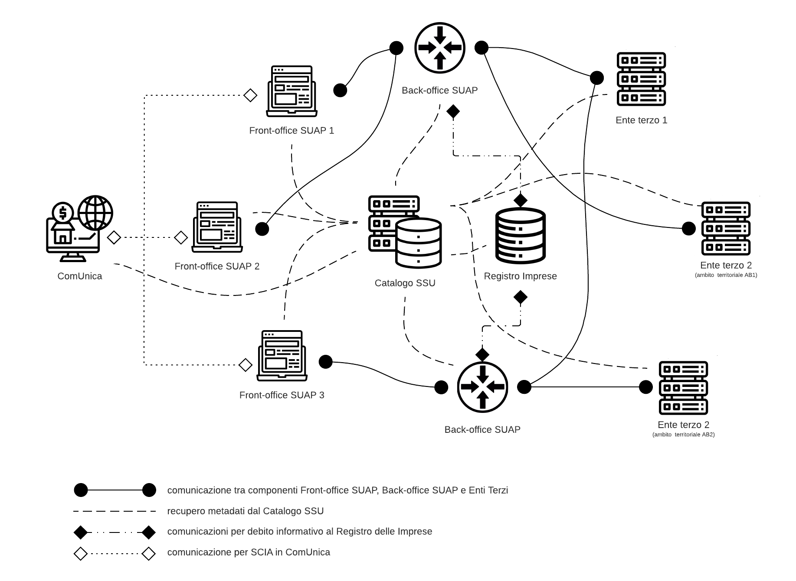

# 4.	Architettura di interoperabilità
Le presenti *Specifiche Tecniche* individuano le modalità telematiche di comunicazione e trasferimento dati, in breve le interoperabilità dei sistemi informatici funzionali ad assicurare alle amministrazioni interessate la disponibilità delle istanze presentate dai *Soggetti presentatori*, al fine di dare seguito alle proprie funzioni istituzionali nell’ambito dei *procedimenti SUAP*.

*L’Allegato DPR 160/2010* indica l'architettura logica quale insieme degli elementi e componenti strutturali che consentono la comunicazione ed il trasferimento dei dati in modalità telematica tra il *SUAP* e le amministrazioni coinvolte nei *procedimenti SUAP*.

La seguente “Figura 1. Architettura di interoperabilità”, basandosi sull’architettura logica indicata nell’*Allegato DPR 160/2010*, descrive l’*Architettura di interoperabilità* da cui prendono spunto le presenti *Specifiche Tecniche*. Si precisa che le stesse *Specifiche Tecniche* individuano le modalità di scambio dei dati tra i sistemi informatici coinvolti, *in primis* le istanze presentate dai *Soggetti presentatori*, per dare seguito alle funzioni istituzionali nell’ambito dei *procedimenti SUAP*, preservando l’autonomia organizzativa delle amministrazioni coinvolte.

L’*Architettura di interoperabilità* include anche:
- il sistema ComUnica, considerata la necessità, ai sensi del comma 2 dell’articolo 5 del decreto della Presidenza della Repubblica 160 del 2010, di gestire i casi in cui la SCIA per i procedimenti *SUAP* è presentata al *Sistema camerale* contestualmente alla comunicazione unica;
- il sistema Registro delle Imprese, per dare seguito a quanto disposto al comma 8
dell’articolo 4 del decreto della Presidenza della Repubblica 160 del 2010.

La “Figura 1. Architettura di interoperabilità”, evidenzia la presenza nel *Sistema degli Sportelli Unici* delle seguenti componenti:
1.	la componente informatica *Front-office SUAP* di cui si DEVONO dotare i SUAP, ai sensi del comma 2 dell’articolo 8 dell’*Allegato DPR 160/2010*;
2.	la componente informatica *Back-office SUAP*, di cui si DEVONO dotare i SUAP, ai sensi del comma 2 dell’articolo 9 dell’*Allegato DPR 160/2010*;
3.	la componente informatica *Enti Terzi*, di cui si DEVONO dotare i uffici comunali diversi dal *SUAP* e le altre pubbliche amministrazioni interessate dal procedimento, ai sensi del comma 2 dell’articolo 10 dell’*Allegato DPR 160/2010*;
4.	la componente infrastrutturale *Catalogo SSU*, resa disponibile dall’amministrazione responsabile della realizzazione della stessa componente, ai sensi del comma 2 dell’articolo 11 dell’*Allegato DPR 160/2010*.

Figura 1. Architettura di interoperabilità

Altresì evidenzia le interazioni rese necessarie dalla norma con:
1.	il sistema Registro delle Imprese, reso disponibile dal *Sistema camerale*;
2.	il sistema ComUnica, reso disponibile dal *Sistema camerale*.

L’Architettura di interoperabilità evidenzia che:
- POSSONO essere presenti più componenti informatiche *Front-office SUAP*;
- POSSONO essere presenti più componenti informatiche *Back-office SUAP*;
- DEVE essere presente un unico *Catalogo SSU*;
- POSSONO essere presenti più componenti informatiche *Enti terzi* per una stessa amministrazione competente sulla base della scelta implementativa di quest’ultima; 
fatta salva la necessità di assicurare che ogni singola componente informatica offra i servizi previsti dalle presenti *Specifiche tecniche* ai *SUAP* inclusi in uno specifico ambito territoriale.

L’Architettura di interoperabilità prevede che:
1.	una componente informatica *Front-office SUAP* DEVE assicurare l’interoperabilità
con le componenti informatiche *Back-office SUAP*;
2.	una componente informatica *Back-office SUAP* DEVE assicurare l'interoperabilità con:
    -	le componenti informatiche *Front-office SUAP*;
    -	le componenti informatiche *Enti terzi*;
3.	le componenti informatiche *Enti terzi* che fanno capo alle amministrazioni coinvolte nei *procedimenti SUAP* DEVONO assicurare l’interoperabilità con le componenti informatiche *Back-office SUAP*.

L’Architettura di interoperabilità individuata assicura:
- ai *SUAP* la possibilità di dare seguito a quanto disposto al comma 2 dell'articolo 8 e al comma 2 dell’articolo 9 dell’Allegato al DPR 160/2010;
- agli uffici comunali e le altre pubbliche amministrazioni interessate dal Procedimento *SUAP* di dare seguito a quanto disposto al comma 2 dell’articolo 10 dell’Allegato al DPR 160/2010.

Al fine di salvaguardare gli investimenti effettuati dai soggetti interessati, per le sole implementazioni già realizzate alla data di pubblicazione delle presenti specifiche tecniche, è ammessa la possibilità di realizzare sistemi informatici che implementano in maniera integrata le componenti informatiche *Front-office SUAP* e *Back-office SUAP*.

> vai a [Indice](../indice.md)
