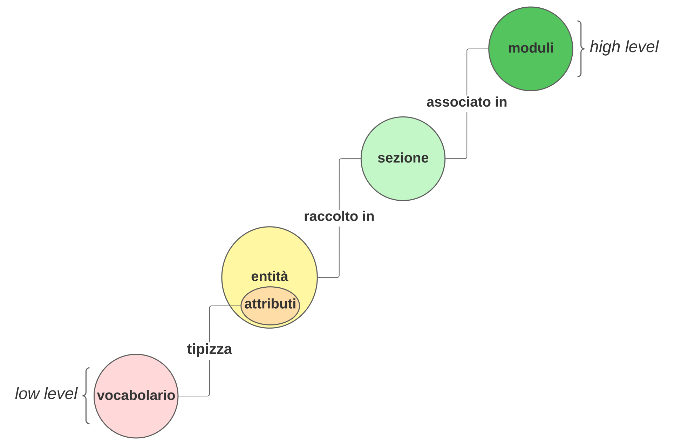

### 5.2.1. Oggetti di validazione gestiti e XML Schema/Schematron definiti 

L’organizzazione delle *Regole di digitalizzazione dei moduli* prevede la creazione e manutenzione dei seguenti oggetti digitali:

- **vocabolari:** rappresentano elenchi di valori ammissibili ed utilizzabili per condizionare la valorizzazione degli attributi;
- **attributi:** rappresentano uno specifico dato declinato con la tipologia, i vincoli, ed eventualmente il vocabolario a cui i valori dello stesso sono vincolati;
- **entità:** rappresenta l'astrazione di un oggetto della realtà quale aggregazione di attributi definiti;
- **sezioni:** rappresentano una porzione delle *Regole di digitalizzazione dei moduli* quale aggregazione di entità compresa la relativa contestualizzazione; 
- **moduli:** rappresentano le *Regole di digitalizzazione dei moduli* quale aggregazione di sezioni definite.

La “Figura 2. Oggetti di validazione e relazioni tra essi” riporta le relazioni esistenti tra gli oggetti di validazione previsti nel framework per la definizione delle *Regole di digitalizzazione dei moduli.*

Nei successivi paragrafi sono riportate le prescrizione del framework per la definizione delle *Regole di digitalizzazione dei moduli* che DEVONO essere considerate per la definizione dei singoli oggetti digitali (vocabolari, attributi, entità sezioni e moduli) indicati in precedenza.

*Figura 2. Oggetti digitali e relazioni tra essi*

[5.2.1.1. Vocabolari](05_02_01_01.md)

[5.2.1.2. Entità](05_02_01_02.md)

[5.2.1.3. Sezioni](05_02_01_03.md)

[5.2.1.4. Moduli](05_02_01_04.md)

> vai a [5.2. Framework per la definizione delle regole di digitalizzazione dei moduli](../05_02.md)