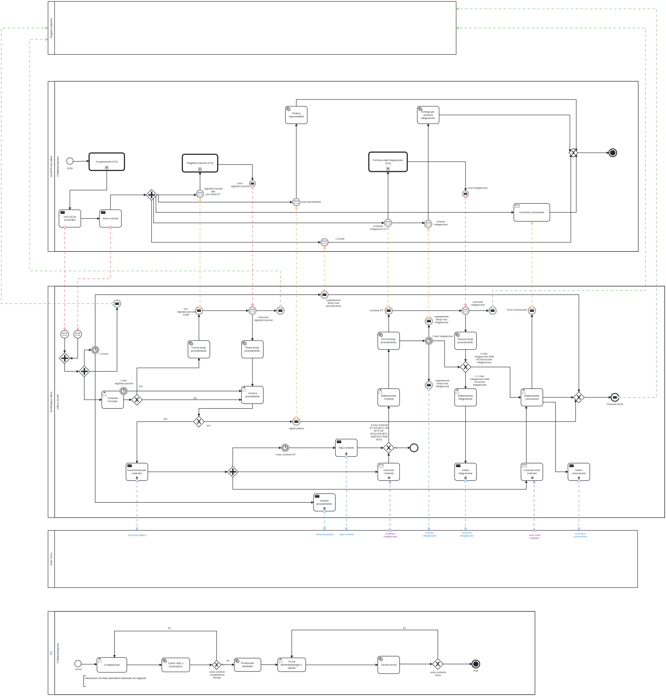

# 6.1.1.	SCIA semplice

Il workflow SCIA semplice formalizza i regimi amministrativi previsti dall’articolo 19 e al comma 2 dell’articolo 19-bis della legge 241 del 1990 e dall’articolo 5 del DPR 160/2010.

Nella “Figura 3. BPMN SCIA semplice” è riportato il BPMN SCIA semplice.

Il BPMN SCIA semplice vede coinvolti:
- il *Registro delle Imprese*, che deve ricevere le evidenze delle SCIA presentate dai *Soggetti presentatori*;
 
- il *Front-office SUAP*, che gestisce le interazioni con i *Soggetti presentatori* a partire dalle presentazione della istanza fino all’eventuale richiesta di conformazione o divieto di prosecuzione dell’attività;
- il *Back-office SUAP*, che coordina il *Processo SUAP* assicurando il coinvolgimento degli *Enti terzi* interessati dallo stesso;
-gli *Enti terzi*, che ricevuta l’istanza presentata dal *Soggetto presentatore*, realizzano le istruttorie di propria competenza.

Il BPMN SCIA semplice individua quattro momenti fondamentali:
1.	compilazione, realizzata sul *Front-office SUAP* che raccoglie l’istanza del *Soggetto presentatore* assicurando:
    - il controllo formale automatico attraverso la validazione dei dati forniti dal *Soggetto presentatore* applicando il modulo digitale specifico al *Processo SUAP* da avviare;
    - la raccolta degli elementi obbligatori per la ricevibilità dell’istanza, compreso il non ripudio dei dati da parte del *Soggetto presentatore*;
2.	regolarizzazione, che vede coinvolti il *Front-office SUAP* e *Back-office SUAP* nel caso in cui a valle del controllo formale sia riscontrata la necessità di richiedere al *Soggetto presentatore* una correzione dell’istanza presentata;
3.	integrazione, che vede coinvolti *Front-office SUAP*, *Back-office SUAP* ed *Enti terzi* nel caso in cui uno o più degli *Enti terzi* constati l’esigenza di richiedere al *Soggetto presentatore* l’integrazione dell’istanza presentata;
4.	conclusione, che vede coinvolti *Front-office SUAP*, *Back-office SUAP* ed *Enti terzi* nel caso in cui uno o più degli Enti terzi, a valle delle proprie istruttorie, accertata la carenza dei requisiti e dei presupposti richiesti, adotti un motivato provvedimento di divieto di prosecuzione dell'attività e di rimozione degli eventuali effetti dannosi della stessa o con atto motivato inviti il *Soggetto presentatore* a conformare l’attività entro un termine.

Figura 3. BPMN SCIA semplice

> vai a [6.1. Workflow dei processi di interoperabilità](06_01.md)
