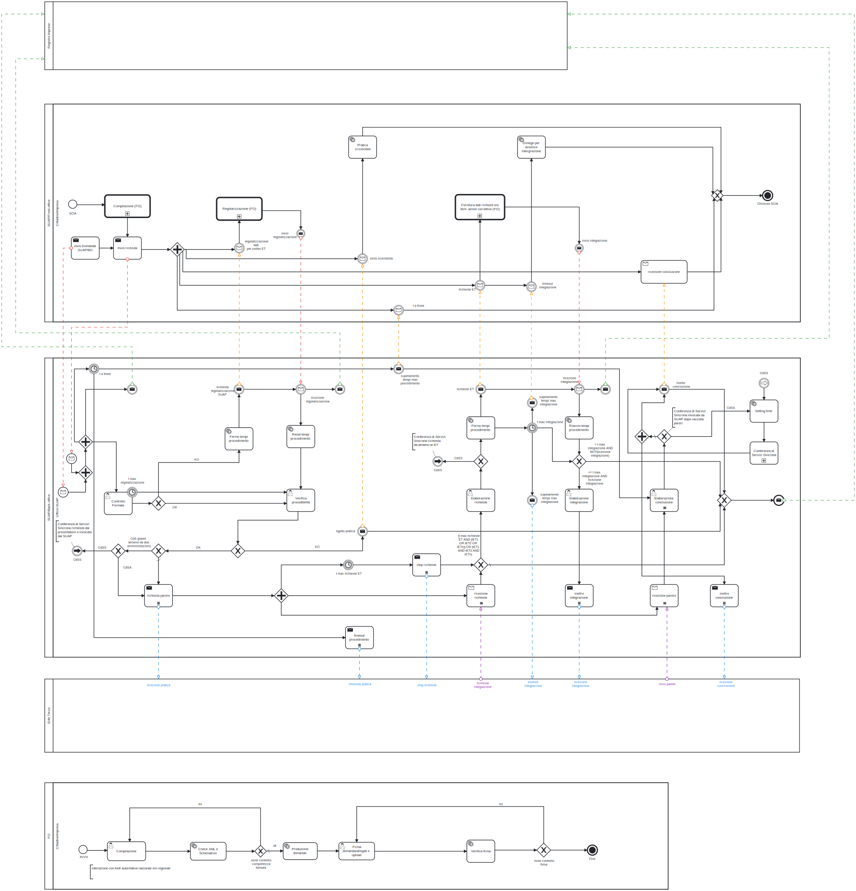

# 6.1.2. Autorizzazione/Domanda

Il workflow Autorizzazione/Domanda formalizza i regimi amministrativi previsti al comma 3 dell’articolo 3-bis e le disposizione in materia di conferenza di servizi di cui all’articolo 14 e seguenti della legge 241 del 1990.

Nella “Figura 4. BPMN Autorizzazione/Domanda” è riportato il BPMN Autorizzazione/Domanda.

Il BPMN Autorizzazione/Domanda vede coinvolti:

- il *Registro delle Imprese*, che deve ricevere le evidenze delle domande di autorizzazione presentate dai *Soggetti presentatori*;
- il *Front-office SUAP*, che gestisce le interazioni con i *Soggetti presentatori* a partire dalla presentazione dell'istanza fino alla comunicazione della conclusione del procedimento amministrativo 
- il *Back-office SUAP*, che coordina il *Processo SUAP* assicurando il coinvolgimento degli *Enti terzi* interessati dallo stesso;
- gli *Enti terzi*, che ricevuta l’istanza presentata dal *Soggetto presentatore*, realizzano le istruttorie di propria competenza.

Il BPMN Autorizzazione/Domande individua quattro momenti fondamentali:

1. compilazione, realizzata sul *Front-office SUAP* che raccoglie l’istanza del *Soggetto presentatore* assicurando:
    - il controllo formale automatico attraverso la validazione dei *moduli digitali* presentati dal *Soggetto presentatore* applicando le *Regole di digitalizzazione dei moduli*;
    - la raccolta degli elementi obbligatori per la ricevibilità dell’istanza, compreso il non ripudio dei dati da parte del Soggetto presentatore;
2. regolarizzazione, che vede coinvolti il *Front-office SUAP* e *Back-office SUAP* nel caso in cui a valle del controllo formale sia riscontrata la necessità di richiedere al *Soggetto presentatore* una correzione dell’istanza presentata;
3. integrazione, che vede coinvolti *Front-office SUAP*, *Back-office SUAP* ed *Enti terzi* nel caso in cui uno o più degli *Enti terzi* constati l’esigenza di richiedere al *Soggetto presentatore* l’integrazione dell’istanza presentata;
4. conclusione, che vede coinvolti *Front-office SUAP*, *Back-office SUAP* ed *Enti terzi* per la raccolta dei pareri/assensi dei singoli *Enti terzi* coinvolti e la predisposizione e consegna al *Soggetto presentatore* della conclusione del processo *SUAP*.

Figura 4. BPMN Autorizzazione Domanda

> vai a [6.1. Workflow dei processi di interoperabilità](06_01.md)
