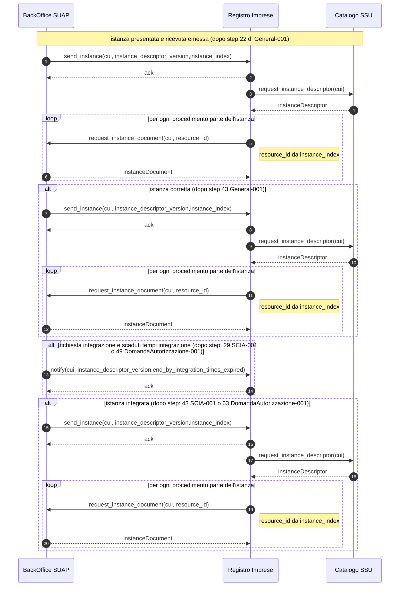

# 6.2.5. Sequence diagram debito informativo Registro delle Imprese

Il sequence diagram debito informativo *Registro delle Imprese* descrive il protocollo di comunicazione realizzato dal *Back-office SUAP* e il sistema del *Registro delle Imprese* per assicurare il debito informativo del *SUAP* al *Registro delle Imprese* nel rispetto del workflow riportato al paragrafo “6.1.1. SCIA semplice”, del workflow riportato al paragrafo “6.1.3. SCIA in ComUnica” o del workflow riportato al paragrafo “6.1.2. Autorizzazione/Domanda”.

*Figura 10. Sequence diagram debito informativo Registro delle Imprese*

> vai a [6.2. Protocolli di comunicazione](06_02.md)