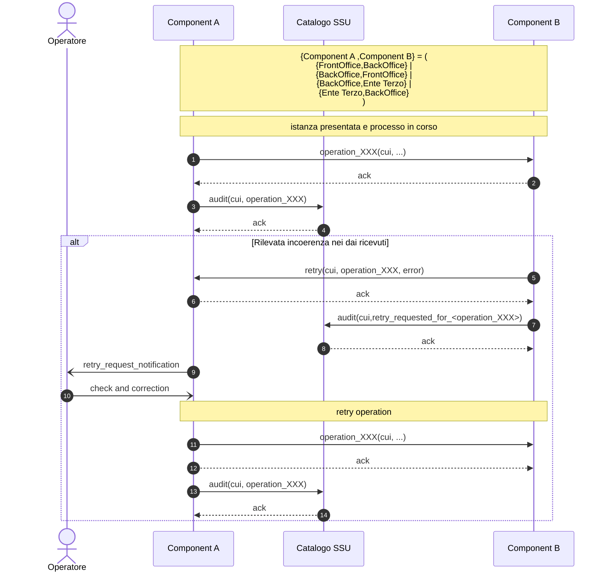
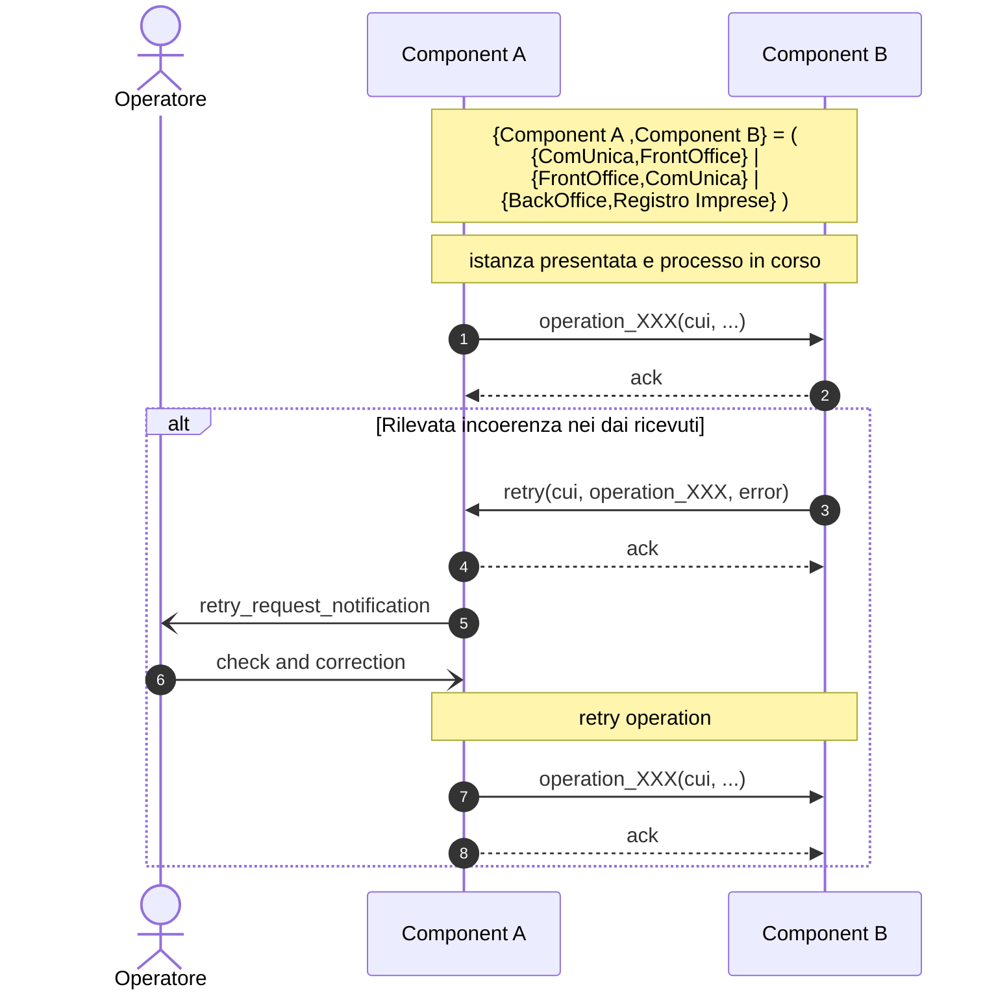

# 6.2.6. Sequence diagram ritrasmissione operazione

Il sequence diagram ritrasmissione operazione descrive il protocollo di comunicazione realizzato dal *Front-office SUAP*, *Back-office SUAP* e *Enti terzi*, per richiedere la ri-esecuzione dell’operazione, nel caso in cui durante le comunicazione la componente ricevente (di seguito Component B) rilevi una incoerenza nei dati ricevuti dalle componente mittente (di seguito Component A).

Il protocollo di comunicazione può essere avviato a valle di una delle operation previste nei protocolli di comunicazione riportati ai paragrafi “6.2.1. Sequence diagram generale”, “6.2.3. Sequence diagram Autorizzazione/Domanda”,  “6.2.3. Sequence diagram Autorizzazione/Domanda” e “6.2.4. Sequence diagram cancellazione istanza”.

*Figura 11. Sequence diagram ritrasmissione operazione tra componenti SSU (Retry-001)*

Nel caso in cui durante le comunicazione tra *Front-office SUAP*, *Back-office SUAP*, sistema del Registro delle Imprese e il sistema ComUnica la componente ricevente (di seguito Component B) rilevi una incoerenza nei dati ricevuti dalla componente mittente (di seguito Component A) si applica il protocollo di comunicazione riportato nella seguente “Figura 12. Sequence diagram ritrasmissione operazione tra componenti SSU e altri…”.

*Figura 12. Sequence diagram ritrasmissione operazione tra componenti SSU e altri sistemi(Retry-002)*

> vai a [6.2. Protocolli di comunicazione](06_02.md)
