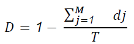
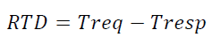

### 8.5.2 Indicatori di livello del servizio

#### Disponibilità

Percentuale di tempo durante il quale il servizio è funzionante (ovvero non si verifica su di esso un disservizio di tipo “bloccante”) all’interno della finestra di erogazione (FdM) e rispetto al periodo di osservazione  (Toss), o meglio definita come:

dove:

- M = numero totale di disservizi bloccanti;
- dj = durata, espressa in minuti, del disservizio bloccante j-esimo nell’ambito della finestra temporale di erogazione;
- T = finestra temporale di misurazione della disponibilità, pari al tempo totale espresso in minuti della finestra temporale di erogazione (FdM) del servizio nel periodo di osservazione (Toss).

#### Round Trip Delay (RTD), Service Invocation and Processing 

Tempo medio orario in secondi che intercorre tra l’invio della Request da parte del client all’endpoint del servizio e la ricezione della Response.

Considerando una banda minima garantita sul canale di trasporto di almeno 64 kbps e la dimensione delle coppie di messaggi request-response  con media 50 KB e deviazione standard 10 KB (*MSGRefsize*)

> vai a [8.5. Livelli di servizio Front-office SUAP, Back-office SUAP e Enti terzi](08_05.md)
