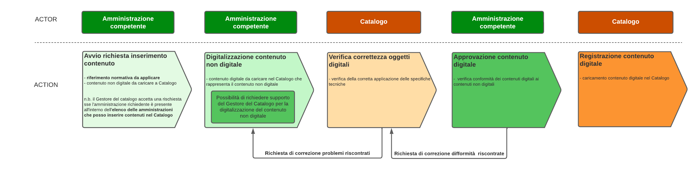

# 9. Requisiti funzionali e non funzionali del Catalogo del Sistema Informatico degli Sportelli Unici

Il *Catalogo SSU* è la componente software che ha il compito di rendere disponibili alle componenti del SSU le informazioni necessarie per interoperare tra di loro assicurando:

- la registrazione delle componenti informatiche *Front-office SUAP*, *Back-office SUAP* ed *Enti terzi*, che aderiscono al Sistema Informatico degli Sportelli Unici;

- 	la consultazione dell’elenco delle componenti informatiche per l’individuazione dei relativi servizi;

-	le regole per lo scambio informatico delle informazioni tra le componenti informatiche di cui ai punti a), b) e c) del comma 3 dell’articolo 3 del decreto della Presidenza della Repubblica 160 del 2010.

La componente altresì è responsabile della generazione del codice univoco dell’istanza (CUI),  della sua  storicizzazione e della successiva registrazione degli eventi che determinano il cambio stato del processo.

Il *Catalogo SSU*, rende disponibile alle amministrazioni competenti le funzionalità per dare seguito al processo di popolamento dei contenuti riportato nella seguente “Figura 14. Processo di popolamento dei contenuti Catalogo SSU”.

Il Processo di popolamento dei contenuti SSU è caratterizzato dalle fasi di seguito riportate.

1.	Avvio richiesta inserimento contenuto, in cui un’Amministrazione competente presenta al *Catalogo SSU* il riferimento normativo e i contenuti non digitali da esso determinati che DEVONO essere inseriti nel *Catalogo SSU*. Il *Catalogo SSU* DEVE verificare che l’Amministrazione competente sia presente nell’elenco delle Amministrazioni competenti.
2.	Digitalizzazione contenuto non digitale, l’Amministrazione competente DEVE provvede alla digitalizzazione del contenuto da inserire nel *Catalogo SSU* nel rispetto delle presenti specifiche tecniche. L'Amministrazione competente PUO’ richiedere il supporto al *Catalogo SSU* per dare seguito alla presente fase.
3.	Verifica correttezza oggetti digitali, il *Catalogo SSU* DEVE verificare la corretta applicazione delle presenti specifiche tecniche. In caso di verifica negativa il *Catalogo SSU* DEVE darne comunicazione all’Amministrazione competente, che provvede alle necessarie modifiche degli oggetti digitali definiti. 
4.	Approvazione contenuto digitale, l’Amministrazione DEVE provvedere all’approvazione dei contenuti digitali da caricare nel *Catalogo SSU* confermando la corrispondenza degli stessi e il quadro normativo di riferimento. In caso di verifica negativa l’Amministrazione competente DEVE indicare al *Catalogo SSU* le difformità riscontrate.
5.	Registrazione contenuto digitale, viene inserito nel *Catalogo SSU* i contenuti digitali approvati dall’Amministrazione competente.

Il *Catalogo SSU* mette a disposizione i contenuti in esso inseriti ed a tal fine sarà coinvolto nei processi di comunicazione e trasferimento dei dati, in modalità telematica, assieme
- al sistema di accreditamento dei *SUAP*, con il quale dovrà interagire per acquisire i dati informativi dei sistemi informatici dei *SUAP* e degli *Enti Terzi*, compresi gli uffici comunali, partecipanti al *Sistema degli Sportelli Unici*.
- al sistema di accreditamento delle istanze delle componenti *SUAP*, con il quale dovrà interagire per acquisire i dati informativi relativi alle abilitazioni e le sospensioni temporanee, sulla base dell’esito della verifica di conformità alle presenti specifiche tecniche, dei sistemi informatici utilizzati: 

    - dai *SUAP* relativamente alle componenti *Front-office SUAP* e *Back-office SUAP* da essi utilizzate;
    - dalle Amministrazioni coinvolte nei *Processi SUAP*, compresi gli uffici comunali, relativamente alla componente *Enti terzi*.
- alle istanze delle componenti di *Front-office SUAP* e *Back-office SUAP* individuate dai *SUAP* oltreché con le istanze delle componenti *Enti terzi* utilizzate dalle Amministrazioni coinvolte nei *Processi SUAP*, compresi gli uffici tecnici comunali, che intervengono negli stessi *Processi SUAP*;
- alla Piattaforma Digitale Nazionale Dati (PDND interoperabilità), con la quale deve interagire per il recupero dei riferimenti degli e-service di ciascun *Front-office SUAP*, *Back-office SUAP* e *Enti terzi*;
-   al sistema *ComUnica* allo scopo di permettere la compilazione della SCIA contestuale alla Comunicazione Unica d’Impresa.

Il Catalogo SSU DEVE:
-   implementare il modello dati riportato al paragrafo “6.3. Metadati per istanziazione dei protocolli di comunicazione”;
-   implementare gli e-service indicati al paragrafo “8.5. e-service resi disponibili dal Catalogo del Sistema Informatico degli Sportelli Unici”.

[9.1. Requisiti funzionali](09_01/09_01.md)

[9.2. Requisiti non funzionali](09_02.md)

> vai a [Indice](../indice.md)
